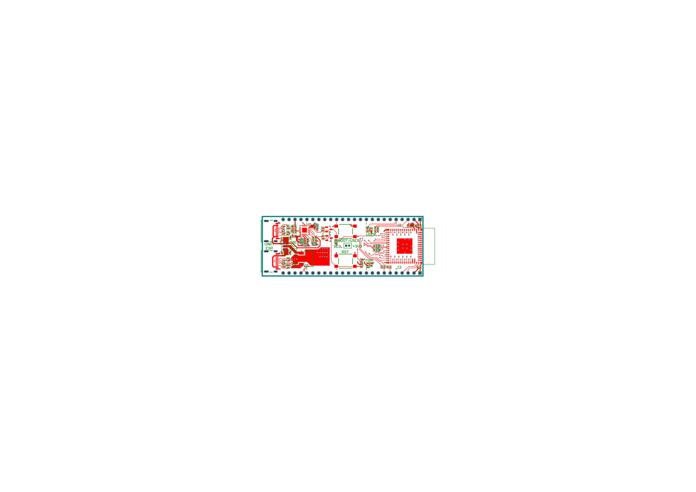
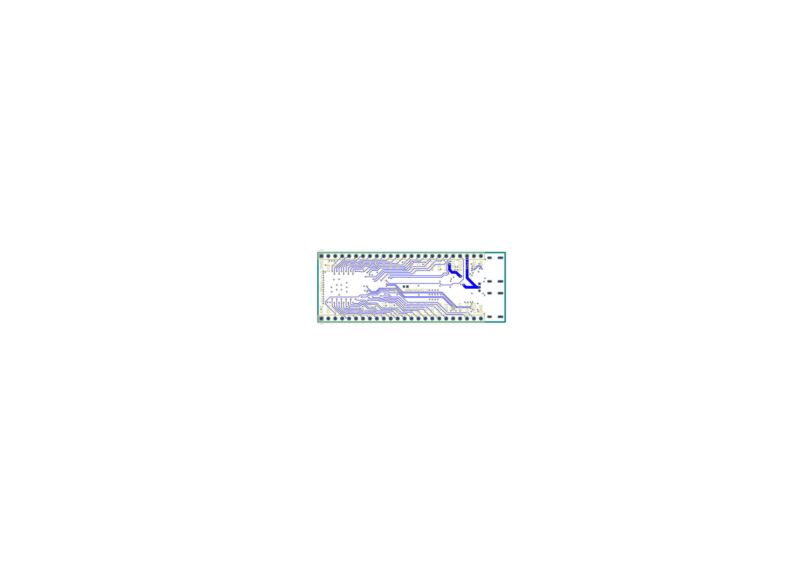

# ESP32-S3 High-Performance Development Board with Dual USB-C

[](https://www.altium.com/)
[](#pcb-stackup--manufacturing-specifications)
[](#high-speed-routing--signal-integrity)
[](#fabrication--manufacturing)
[](LICENSE)

A high-reliability, custom-engineered **4-layer development platform** built around the **Espressif ESP32-S3-MINI-1-N8** microcontroller (Xtensa® 32-bit LX7 dual-core up to 240 MHz, 8MB Quad SPI Flash, Wi-Fi 4 & Bluetooth 5.0 LE). 

Designed for professional embedded systems development, this board integrates **dual USB Type-C connectivity**—providing both native hardware USB-OTG/JTAG debugging and an isolated high-speed UART interface via an onboard **FTDI FT231XQ-R** bridge with transistor-automated hardware flashing.

---

## Key Hardware Architectural Features

### 1. Dual USB Type-C Architecture
* **Native USB-OTG Port (`J3`):** Connected directly to the ESP32-S3 native USB D+/D- pins for hardware USB-JTAG debugging, direct CDC serial, DFU bootloading, and high-speed USB device/host operation.
* **FTDI UART Bridge Port (`J4`):** Dedicated programming and serial console port driven by the **FTDI FT231XQ-R** (Full-Speed USB to Full UART in QFN-20). Eliminates driver complications and provides dedicated, uninterrupted hardware logging during firmware execution.
* **USB-C Compliance:** Dual 5.1kΩ configuration channel (CC1/CC2) pull-down termination on each receptacle to ensure full compliance with USB Type-C Current Mode sourcing up to 3A @ 5V.

### 2. Transistor-Automated Boot & Reset Circuitry
* Utilizes a dual NPN transistor network (**Comchip SS8050-G**) cross-coupling FTDI `DTR` and `RTS` signals into the ESP32-S3 `CHIP_PU` (Reset) and `GPIO0` (Boot) lines.
* Enables hands-free firmware flashing from ESP-IDF, PlatformIO, or Arduino IDE without needing manual button presses.
* Integrated tactile switches (**C&K PTS645SH50SMTR92LFS**) provide manual hardware override for Reset and Boot mode selection.

### 3. Industrial Power Distribution & Thermal Stability
* **High-Current LDO Regulator:** **Texas Instruments TL1963A-33DCYR** (SOT-223-4).
  * Rated for continuous **1.5A output** at 3.3V with ultra-fast transient response to effortlessly absorb the steep 400mA+ current spikes characteristic of 2.4GHz 802.11b/g/n RF transmissions.
  * Ultra-low output noise voltage (40 µVRMS over 10 Hz to 100 kHz) for analog/ADC integrity.
* **Decoupling Network:** Distributed 0402 ceramic multi-layer capacitors (Samsung X7R/X5R 100nF, 4.7µF, and 10µF bulk decoupling) situated immediately adjacent to module power pins and LDO terminals.

### 4. Robust Transient & ESD Protection
* **Littelfuse AQ3045-01ETG** bidirectional TVS diode arrays placed at the boundary of all external USB data and VBUS lines (SOD-882 footprint).
* Rated for **±30kV contact and air ESD discharges** (IEC 61000-4-2) and up to 12A (8/20µs) lightning surge protection, ensuring operational resilience on testbenches and field deployments.

---

## PCB Stackup & Manufacturing Specifications

The board utilizes a symmetrical **4-layer stackup** designed for optimal EMI suppression and consistent ground reference planes:

| Layer # | Layer Name | Layer Type | Copper Weight | Function / Net Allocation |
|:-------:|:-----------|:-----------|:-------------:|:--------------------------|
| **L1**  | Top Layer  | Signal / Component | 1.0 oz (35 µm) | Critical high-speed signals, RF keepouts, USB differential traces |
| **L2**  | Inner Layer 1 | Internal Plane | 1.0 oz (35 µm) | Continuous, unbroken **Ground Reference Plane (GND)** |
| **L3**  | Inner Layer 2 | Internal Plane | 1.0 oz (35 µm) | Split Power Plane (**3.3V System Rail & 5V VBUS Distribution**) |
| **L4**  | Bottom Layer | Signal / Ground | 1.0 oz (35 µm) | Low-speed routing, non-critical breakouts, ground shield polygon pour |

### Physical Parameters
* **Board Dimensions:** Standard breadboard-friendly form factor with 2.54mm (0.1") dual-row headers.
* **Minimum Trace Width:** 6 mil (0.152 mm)
* **Minimum Clearance:** 6 mil (fine-pitch IC rooms), 8 mil (general signals), 10 mil (power polygons)
* **Differential Impedance:** 90Ω ±10% controlled differential impedance for USB D+/D- signal lines (`DIFF90` class).
* **DRC Verification:** **0 Violations** (verified against standard IPC-2221 Class 2 rules).

---

## Hardware Visualizations

### Board Layout (Top & Bottom)

*Figure 1: High-density component placement and routing visualization (Top Layer).*


*Figure 2: Power and ground distribution visualization (Bottom Layer).*

---

## Bill of Materials (BOM Summary)

Full engineering BOM is available in both [`Documentation/Bill_of_Materials.xlsx`](Documentation/Bill_of_Materials.xlsx) and [`Documentation/Bill_of_Materials.csv`](Documentation/Bill_of_Materials.csv).

| Designator | Quantity | Description | Manufacturer | MPN | Package |
|:---|:---:|:---|:---|:---|:---|
| **U1** | 1 | 2.4GHz Wi-Fi/BLE Dual-Core SoC Module, 8MB SPI Flash | Espressif Systems | `ESP32-S3-MINI-1-N8` | SMD Module |
| **U2** | 1 | Full-Speed USB to Full UART Bridge Controller | FTDI | `FT231XQ-R` | QFN-20 |
| **U3** | 1 | Low-Noise 1.5A Fast-Transient LDO Linear Regulator, 3.3V | Texas Instruments | `TL1963A-33DCYR` | SOT-223-4 |
| **J3, J4** | 2 | USB 2.0 Type-C Receptacle, 24-Pin Right-Angle SMD | Molex | `217179-0001` | SMT Hybrid |
| **J1, J2** | 2 | 24-Pin Breakout Header, 2.54mm Pitch | Molex | `0022284245` | Through-Hole |
| **Q1, Q2** | 2 | NPN Bipolar Transistor 25V 1.5A (Auto-Reset Circuit) | Comchip | `SS8050-G` | SOT-23-3 |
| **D3-D8** | 6 | Bidirectional TVS Diode 5.3V Clamping 12A (ESD Protection) | Littelfuse | `AQ3045-01ETG` | SOD-882 |
| **D1** | 1 | Yellow-Green LED (3.3V Power Good Indicator) | Vishay | `VLMG1500-GS08` | 0402 SMD |
| **D2** | 1 | Red LED (UART Activity / Status Indicator) | Vishay | `VLMS1500-GS08` | 0402 SMD |
| **SW1, SW2** | 2 | SPST Tactile Pushbutton (Reset & Boot Mode) | C&K Components | `PTS645SH50SMTR92LFS` | SMD Tact |
| **C1-C16** | 15 | Ceramic Capacitors (100nF, 1µF, 4.7µF, 10µF) 10V-50V X7R/X5R | Samsung Electro-Mechanics | Multiple | 0402 SMD |
| **R1-R24** | 22 | Precision SMD Thick Film Resistors (0R, 27R, 1K, 4.7K, 5.1K, 10K) | Yageo | Multiple | 0402 SMD |

---

## Pinout Mapping

The board breaks out all functional GPIOs of the ESP32-S3-MINI module onto two 24-pin 0.1" (2.54mm) headers (`J1` and `J2`), fully documented in [`Documentation/ESP32_Pinout_Sheet.xlsx`](Documentation/ESP32_Pinout_Sheet.xlsx):

* **Power & Ground:** 3.3V regulated rail, 5V VBUS input, multiple low-impedance ground returns.
* **Analog Inputs:** ADC1 channels 0-9 and ADC2 channels 0-9.
* **High-Speed Busses:** SPI / Dual / Quad SPI lines, hardware UART, I2C, and PWM timers.
* **JTAG & Debug:** Dedicated USB-JTAG pins routed to native USB-C connector.

---

## Repository Structure

```
├── Hardware/
│   ├── ESP32 with USBC.PrjPcb         # Altium Project master file
│   ├── ESP32 with USBC.SchDoc         # Complete schematic sheets
│   ├── ESP32 with USBC.PcbDoc         # 4-layer routed PCB layout
│   ├── PcbLib.PcbLib                  # Custom component PCB footprints
│   ├── Schlib.SchLib                  # Custom schematic symbols
│   └── Job.OutJob                     # Altium Output Job configuration
├── Fabrication/
│   ├── ESP32 with USBC.GTL            # Top Copper Gerber
│   ├── ESP32 with USBC.G1             # Inner Ground Plane 1
│   ├── ESP32 with USBC.GP1            # Inner Power Plane 2
│   ├── ESP32 with USBC.GBL            # Bottom Copper Gerber
│   ├── ESP32 with USBC.GTO / .GBO     # Top & Bottom Silkscreen
│   ├── ESP32 with USBC.GTS / .GBS     # Top & Bottom Soldermask
│   ├── ESP32 with USBC.DRR / .TXT     # NC Drill definition & coordinates
│   ├── Pick_and_Place.csv             # Automated SMT Pick & Place centroids
│   └── Design_Rule_Check.drc          # Altium DRC report (0 errors)
├── Documentation/
│   ├── Bill_of_Materials.xlsx         # Engineering BOM with distributor part numbers
│   ├── Bill_of_Materials.csv          # Machine-readable BOM
│   ├── ESP32_Pinout_Sheet.xlsx        # Pinout and alternate function matrix
│   ├── ESP32-S3-MINI-1_Datasheet.pdf  # Espressif hardware datasheet
│   └── Board_Checking.pdf             # Manufacturing layout documentation
├── Images/
│   ├── board_layout_top.png           # Top layer rendering
│   └── board_layout_bottom.png        # Bottom layer rendering
└── README.md
```

---

## Author & Contact

**Aakashdip Dey**  
*Hardware & Embedded Electronics Engineer*  
* Vellore, India  
* GitHub: [@AakashdipDey](https://github.com/AakashdipDey)
